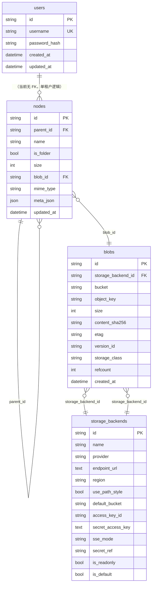

# ZeroDrive 数据模型与数据库说明

本文档描述 ZeroDrive 后端当前 **SQLite** 库表结构、实体关系、约束与启动期迁移行为，与代码中 SQLAlchemy 模型（`backend/app/models/`）一致。

相关文档：

- HTTP 对外字段见 [`API.md`](./API.md)（`NodeOut` 不暴露 `blob_id` 等内部列）。
- 对象存储部署与驱动见 [`STORAGE_ARCHITECTURE.md`](./STORAGE_ARCHITECTURE.md)。
- 运维与 MinIO 配置见 [`backend/README.md`](../backend/README.md)。

---

## 1. 总览

### 1.1 数据库引擎

| 项 | 说明 |
|----|------|
| 引擎 | **SQLite 3**（异步访问：`sqlite+aiosqlite`） |
| 默认路径 | 由环境变量 `SQLITE_PATH` 指定，默认 `./data/zerodrive.db` |
| 外键 | 连接时执行 `PRAGMA foreign_keys=ON` |
| 建表 | 应用启动时 `Base.metadata.create_all`；部分列由启动脚本 `ALTER TABLE` 补齐 |

当前 **未使用** Alembic 等独立迁移工具；结构演进依赖 `app/main.py` lifespan 与 `app/services/storage_bootstrap.py`。

### 1.2 概念分层

```
users          — 登录账号（与节点树暂无外键关联，见 1.3）
nodes          — 用户可见目录树（文件夹 / 文件节点）
storage_backends — 逻辑存储端（本地盘、S3/MinIO 等）
blobs          — 物理对象（字节位置：后端 + bucket + object_key）
```

- **文件节点**：`nodes.is_folder = 0` 且 `nodes.blob_id` 非空，指向一条 `blobs`。
- **文件夹节点**：`nodes.is_folder = 1`，`blob_id` 为 `NULL`，`size` 一般为 `0`。
- **字节实体**不在 `nodes` 表重复存储路径，统一在 `blobs`。

### 1.3 实体关系图



**说明：** `users` 与 `nodes` 在库中 **没有外键**；当前产品为单管理员账号 + 共享一棵目录树。若未来做多用户网盘，需增加 `owner_id` 或 `tenant_id` 等字段。

---

## 2. 表定义

### 2.1 `users` — 用户

| 列名 | 类型 | 约束 | 说明 |
|------|------|------|------|
| `id` | `VARCHAR(36)` | PK | UUID 字符串 |
| `username` | `VARCHAR(64)` | NOT NULL, **UNIQUE**, INDEX | 登录名 |
| `password_hash` | `VARCHAR(255)` | NOT NULL | bcrypt 等哈希，明文不入库 |
| `created_at` | `DATETIME` (tz) | NOT NULL | 创建时间（UTC） |
| `updated_at` | `DATETIME` (tz) | NOT NULL | 更新时间（UTC） |

**业务规则：**

- 首次启动若不存在配置中的 `ADMIN_USERNAME`，会插入一条管理员（见 `app/main.py` lifespan）。

---

### 2.2 `nodes` — 目录树节点

| 列名 | 类型 | 约束 | 说明 |
|------|------|------|------|
| `id` | `VARCHAR(36)` | PK | UUID |
| `parent_id` | `VARCHAR(36)` | FK → `nodes.id`, **ON DELETE CASCADE**, NULL 允许 | 父节点；根节点为 `NULL` |
| `name` | `VARCHAR(512)` | NOT NULL | 展示名（同父下唯一性由应用层校验） |
| `is_folder` | `BOOLEAN` | NOT NULL | `1` 文件夹，`0` 文件 |
| `size` | `INTEGER` | NOT NULL | 文件字节数；文件夹多为 `0` |
| `blob_id` | `VARCHAR(36)` | FK → `blobs.id`, **ON DELETE RESTRICT**, NULL 允许 | 文件内容引用；文件夹为 `NULL` |
| `mime_type` | `VARCHAR(255)` | NULL | 上传时的 Content-Type |
| `meta_json` | `JSON` | NULL | 媒体元数据（如 ffprobe 结果） |
| `updated_at` | `DATETIME` (tz) | NOT NULL | 最后变更时间 |

**固定主键（种子）：**

| `id` | 含义 |
|------|------|
| `00000000-0000-4000-8000-000000000001` | **根文件夹**（`ROOT_FOLDER_ID`），`parent_id = NULL`，`name` 可为空字符串 |

**业务规则：**

- 删除节点：子树按 **后序** 删除；子节点先删，避免自引用 FK 顺序问题（`node_service.delete_cascade`）。
- 重命名 / 移动：同父（或目标父）下 **名称唯一** 由应用层 `ConflictError` 保证，库无复合 UNIQUE。
- 根节点不可重命名、移动、删除。
- **已移除列 `storage_key`**：旧版曾在此存本地相对路径；升级后由 `blobs.object_key` 承担（见第 4 节）。

**与 API 的对应：** 对外 `NodeOut` 仅包含 `id, parent_id, name, is_folder, size, mime_type, meta_json, updated_at`，不含 `blob_id`。

---

### 2.3 `storage_backends` — 逻辑存储端

| 列名 | 类型 | 约束 | 说明 |
|------|------|------|------|
| `id` | `VARCHAR(36)` | PK | UUID；种子数据使用固定 ID（见下表） |
| `name` | `VARCHAR(128)` | NOT NULL | 可读名称，如 `primary-local` |
| `provider` | `VARCHAR(32)` | NOT NULL | `local` \| `minio` \| `aws` \| `generic_s3` \| `aliyun` 等 |
| `endpoint_url` | `TEXT` | NULL | S3 API 地址；`local` 一般为 `NULL` |
| `region` | `VARCHAR(64)` | NOT NULL | 区域；本地可为空串 |
| `use_path_style` | `BOOLEAN` | NOT NULL | MinIO 等多为 `true` |
| `default_bucket` | `VARCHAR(255)` | NOT NULL | 默认桶名；本地可为空串 |
| `access_key_id` | `VARCHAR(512)` | NULL | 静态密钥（可选） |
| `secret_access_key` | `TEXT` | NULL | 静态密钥（可选） |
| `sse_mode` | `VARCHAR(32)` | NULL | 如 `aes256` 表示上传 SSE-S3 |
| `secret_ref` | `VARCHAR(255)` | NOT NULL | 保留字段，当前实现以表内密钥 / `AWS_*` 环境变量为准 |
| `is_readonly` | `BOOLEAN` | NOT NULL | 只读后端（如迁出中的旧集群） |
| `is_default` | `BOOLEAN` | NOT NULL | **新上传**选用的默认后端 |

**种子固定 ID（`storage_bootstrap.py`）：**

| `id` | 典型用途 |
|------|----------|
| `00000000-0000-4000-8000-000000000002` | `LOCAL_BACKEND_ID` — 本地 `DATA_ROOT` |
| `00000000-0000-4000-8000-000000000003` | `S3_BACKEND_ID` — 空库且 `STORAGE_DRIVER=s3` 时的默认 S3 行 |

**业务规则：**

- 表 **非空** 时，启动 **不再** 根据 `.env` 重写行；改连接请 `UPDATE` 本表或清表后重新种子。
- 表 **为空** 时：按 `STORAGE_DRIVER` 插入 1～2 行（`local` 仅本地默认；`s3` 为本地只读 legacy + S3 默认）。
- 运行时上传：查询 `is_default = 1` 的后端，经 Driver 写入对象存储。

**凭证解析（应用层，非 DB 约束）：**

1. `access_key_id` + `secret_access_key` 均有值 → 使用表内密钥。  
2. 否则 → 使用环境变量 `AWS_ACCESS_KEY_ID` / `AWS_SECRET_ACCESS_KEY`（如实例角色场景）。

---

### 2.4 `blobs` — 物理对象

| 列名 | 类型 | 约束 | 说明 |
|------|------|------|------|
| `id` | `VARCHAR(36)` | PK | UUID |
| `storage_backend_id` | `VARCHAR(36)` | FK → `storage_backends.id`, **ON DELETE RESTRICT** | 对象所在逻辑后端 |
| `bucket` | `VARCHAR(255)` | NOT NULL | S3 桶名；本地后端多为 `""` |
| `object_key` | `VARCHAR(1024)` | NOT NULL | 对象键；本地为 `DATA_ROOT` 下相对路径（常为 UUID 文件名） |
| `size` | `INTEGER` | NOT NULL | 字节数 |
| `content_sha256` | `VARCHAR(64)` | NULL | 预留：去重 / 校验（当前上传未写入） |
| `etag` | `VARCHAR(128)` | NULL | S3 返回的 ETag |
| `version_id` | `VARCHAR(255)` | NULL | 桶开启版本控制时的版本 ID |
| `storage_class` | `VARCHAR(32)` | NULL | 预留：STANDARD / IA 等 |
| `refcount` | `INTEGER` | NOT NULL, 默认 `1` | 引用该 blob 的文件节点数 |
| `created_at` | `DATETIME` (tz) | NOT NULL | 创建时间 |

**业务规则：**

- 上传成功：插入 `blobs`，`refcount = 1`，`nodes.blob_id` 指向该 `id`。
- 删除文件节点：子树内对每个 `blob_id` 计数递减；`refcount <= 0` 时删除 `blobs` 行，并在 **事务提交后** 调用 Driver 删除实际对象（`purge_storage_after_delete`）。
- 未来 **硬链 / 去重**：可多行 `nodes` 指向同一 `blob_id`，靠 `refcount` 管理生命周期（当前业务每次上传仍新建 blob）。
- 定位对象：`(storage_backend_id, bucket, object_key)` 在应用内应唯一；库层未建复合 UNIQUE。

---

## 3. 外键与删除语义

| 子表 | 父表 | ON DELETE | 含义 |
|------|------|-----------|------|
| `nodes.parent_id` | `nodes.id` | **CASCADE** | 删父则级联删子孙节点行 |
| `nodes.blob_id` | `blobs.id` | **RESTRICT** | 有节点引用时不能直接删 blob 行（须先解绑或删节点） |
| `blobs.storage_backend_id` | `storage_backends.id` | **RESTRICT** | 仍有 blob 时不能删后端配置行 |

**注意：** 物理文件/对象的删除发生在应用逻辑中（commit 之后），不是 FK 级联。

---

## 4. 启动期 schema 演进（当前实现）

应用 `lifespan` 顺序（摘要）：

1. `create_all` — 创建缺失表（`users`, `nodes`, `storage_backends`, `blobs`）。
2. `ensure_nodes_columns` — 若缺则 `ALTER`：`mime_type`, `meta_json`。
3. `ensure_node_blob_id_column` — 若缺则 `ALTER`：`blob_id`。
4. `ensure_storage_backend_columns` — 若缺则 `ALTER`：`access_key_id`, `secret_access_key`, `sse_mode`。
5. `seed_storage_backends_if_empty` — 仅当 `storage_backends` 行数为 0。
6. `migrate_legacy_storage_keys_to_blobs` — 若仍存在列 `storage_key`，迁到 `blobs` + `blob_id`。
7. `drop_nodes_storage_key_column` — 删除 `nodes.storage_key`（**需 SQLite ≥ 3.35**）。
8. 确保根 `nodes` 行与管理员 `users` 行存在。

### 4.1 旧版 `storage_key` 迁移（一次性）

适用于升级前库结构含 `nodes.storage_key`、文件在 `DATA_ROOT` 的情况：

| 旧 | 新 |
|----|-----|
| `nodes.storage_key` = 相对路径 | `blobs.object_key` = 同值 |
| — | `blobs.storage_backend_id` = `LOCAL_BACKEND_ID` |
| — | `blobs.bucket` = `""` |
| — | `nodes.blob_id` → 新 blob |

迁移完成后 **DROP** `storage_key` 列；磁盘文件 **无需移动**。

---

## 5. 查询与索引（现状）

| 表 | 索引 / 约束 |
|----|-------------|
| `users` | `username` UNIQUE + INDEX |
| `nodes` | 仅 PK；**无** `(parent_id, name)` 唯一索引 |
| `storage_backends` | 仅 PK |
| `blobs` | 仅 PK |

常见访问模式（应用层）：

- 列目录：`WHERE parent_id = ? ORDER BY is_folder DESC, name ASC`
- 默认后端：`WHERE is_default = 1 LIMIT 1`
- 面包屑：沿 `parent_id` 向上递归查 `nodes`

数据量增大时可考虑：`nodes(parent_id)`、`nodes(blob_id)`、`blobs(storage_backend_id)` 等二级索引（当前未建）。

---

## 6. 预留 / 未实现的表

设计文档 [`STORAGE_ARCHITECTURE.md`](./STORAGE_ARCHITECTURE.md) 中规划、**当前库中尚未创建**：

| 表 | 用途 |
|----|------|
| `multipart_uploads` | 大文件分片上传会话、S3 UploadId、过期清理 |

其它可能演进（无表结构）：

- `nodes` 与 `users` 的多对一归属（`owner_id`）
- `nodes.deleted_at` 软删除、回收站
- `blobs.content_sha256` 写入与秒传去重

---

## 7. 与物理存储的对应

| `provider` | `blobs` 定位方式 |
|------------|------------------|
| `local` | `object_key` → `{DATA_ROOT}/{object_key}` 文件 |
| S3 兼容 | `endpoint_url` + `bucket` + `object_key` → PutObject / GetObject |

`nodes.name` **仅用于展示与目录逻辑**；对象存储中的 key **不要求** 与 `name` 相同（通常为 UUID）。

---

## 8. 维护与排错

| 操作 | 建议 |
|------|------|
| 备份 | 复制 `SQLITE_PATH` 文件；对象存储另备桶数据或 `DATA_ROOT` |
| 查看默认后端 | `SELECT * FROM storage_backends WHERE is_default = 1` |
| 查文件落在哪 | `SELECT n.id, n.name, b.object_key, b.bucket, sb.provider FROM nodes n JOIN blobs b ON n.blob_id = b.id JOIN storage_backends sb ON b.storage_backend_id = sb.id WHERE n.id = ?` |
| 孤儿对象 | 库中无 `refcount>0` 引用但桶里仍有 key — 需 GC 脚本（未内置定时任务） |

---

*文档版本与 `backend/app/models` 同步；表结构变更时请同时更新本文档与 `STORAGE_ARCHITECTURE.md`。*
